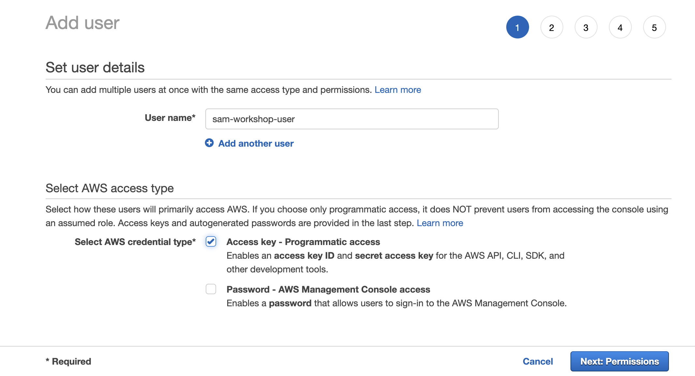
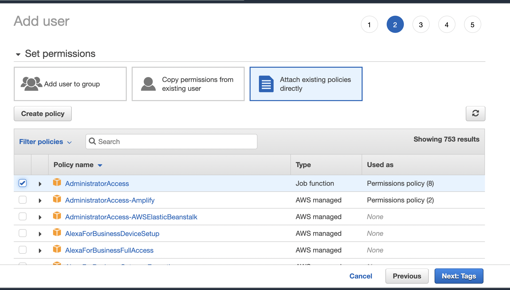
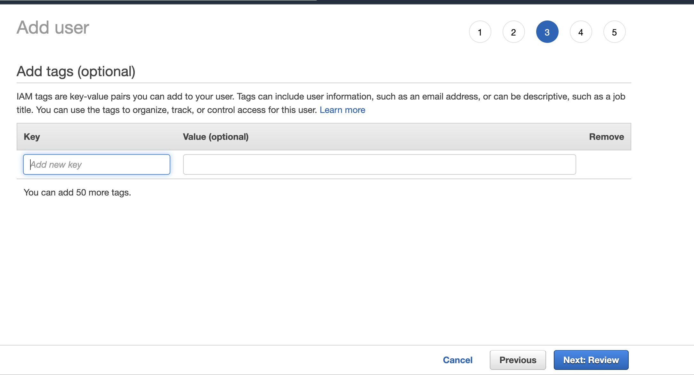
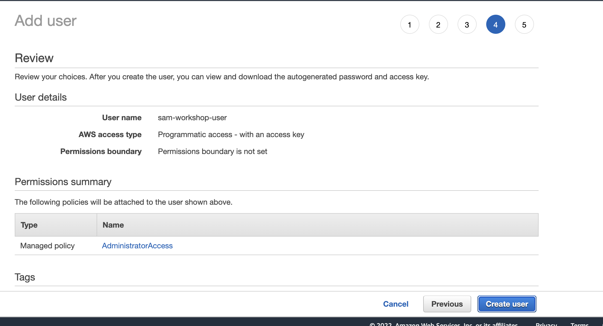

# Aws account and user
To deploy your app, you’ll need access to an AWS account. 
If you already have an account and your system is configured with credentials of an administrator user, you can move to the next step.

### Administrative user
1) Sign in to your AWS account

2) Go to the AWS IAM console and [create a new user](https://us-east-1.console.aws.amazon.com/iamv2/home#/users).

3) Type a name for your user (e.g. sam-workshop-user) and choose “Programmatic access”.





4) In the next screen, you’ll see your Access key ID and you will have the option to click Show to show the Secret access key. Keep this browser window open.

# Configure your credentials

Open a terminal window and use aws configure to set up your environment. Type the access key ID and secret key and choose a default region (you can use us-east-1, eu-west-1, us-west-2 for example). 
Preferably use a region that doesn’t have any resources already deployed into it.

```
aws configure
```
And fill in the information from the console:

```
AWS Access Key ID [None]: <type key ID here>
AWS Secret Access Key [None]: <type access key>
Default region name [None]: <choose region (e.g. "us-east-1", "eu-west-1")>
Default output format [None]: <leave blank>
```