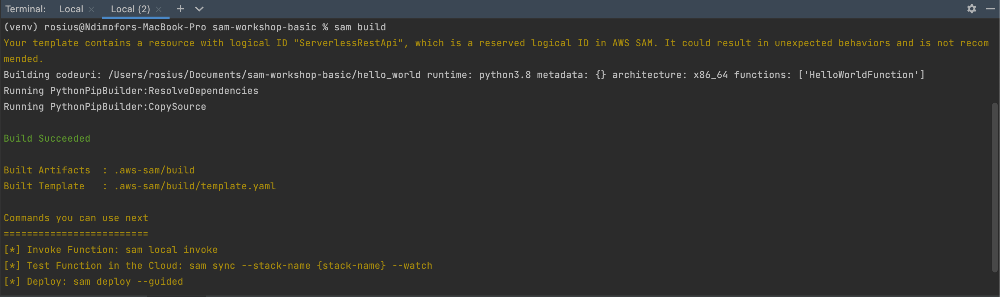
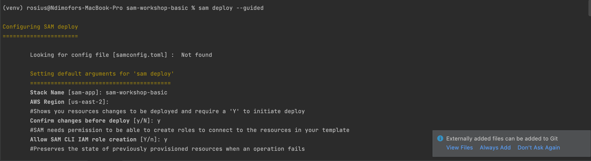

# SAM BUILD AND DEPLOY
Now that we've created a SAM project, let's go ahead and deploy the app to the cloud. 
Firstly, we'll go ahead and deploy our app the old fashion way. That is, using the commands.
- `sam build`
- `sam deploy --guided`

For Every single update we make to the app, be it configuration or code or both, we need to run the above commands to 
deploy our application to the cloud. It's  time-consuming and definitely affect developer productivity.

With this in mind, let's look at the first feature of **SAM ACCELERATE** called `sam sync`