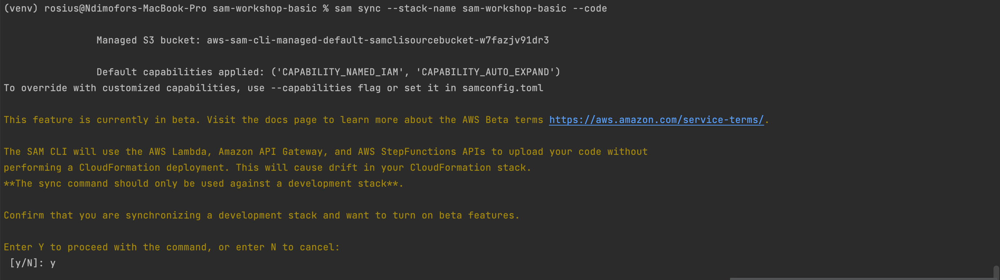
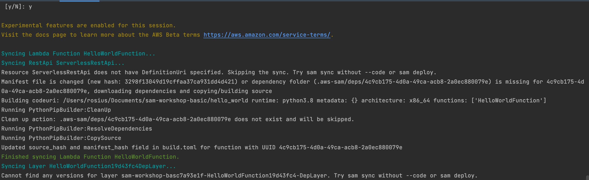

!!!
sam sync --stack-name {stack-name} --code
!!!

Most times, we don't want to synchronize our entire app to the cloud when we do a code update. We only want to push that part we 
updated. 
The `--code` option of `sam sync` comes in.
<br />

Let's see it in action.

Let's make an update to our lambda function and use the `sam sync` with `--code`  command to sync our app to the cloud.
```python
 {
        "statusCode": 200,
        "body": json.dumps({
            "message": "hello world",
            # "location": ip.text.replace("\n", "")
        }),
    }
```

to 

```python
 {
        "statusCode": 200,
        "body": json.dumps({
            "message": "hello world, Welcome to Ghana AWS Meetup",
            # "location": ip.text.replace("\n", "")
        }),
    }
```
Now, run the command `sam sync --stack-name {stack-name} --code` and watch the app deploy under 10 seconds 
My stack name here is `sam-workshop-basic`




The sam sync command verifies each of the code types present and synchronizes the sources to the cloud. 
This example uses an API Gateway REST API and two Lambda functions. 
AWS SAM skips the REST API because there is no external OpenAPI file for this project. 
However, the Lambda functions and their dependencies are synchronized.
