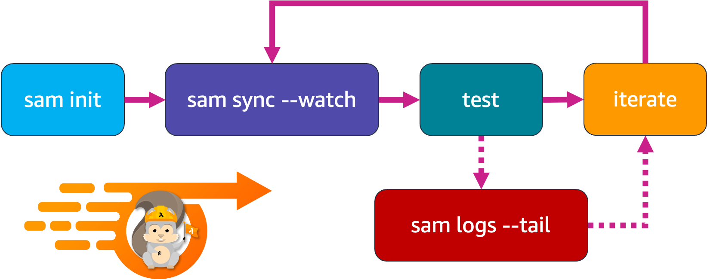

The final part of AWS SAM Accelerate’s beta feature set is aggregating logs for developer feedback. 
This feature is an enhancement to the already existing `sam logs` command.
In addition to pulling Amazon CloudWatch Logs or the Lambda function, it is now possible to retrieve logs for API Gateway and traces from AWS X-Ray.

```
sam logs --stack-name blog --include-traces --tail
```

The `sam logs` command returns logs for 
- AWS Lambda function
- Amazon API Gateway REST execution logs
- AWS X-Ray traces

Set logs and tracer, in-order to see logs in lambda. 
Use the `aws-lambda-powertools` library to log easily

