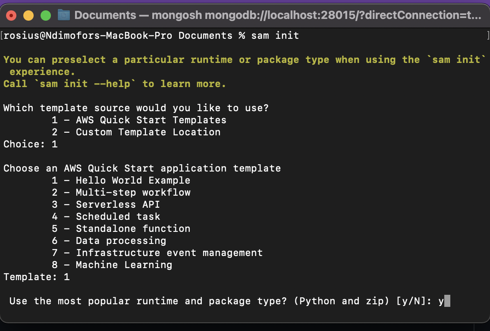
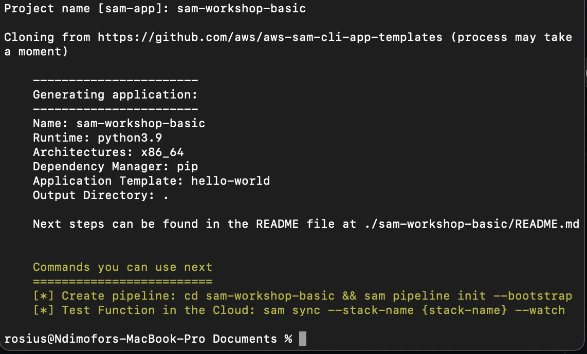

# New project
After installing the prerequisites, 
1) Open up a terminal/command prompt and run the command `sam init`
 

2) Choose the quick start template and then the hello world example
 

3) Select python as your runtime language.
 

4) Give your project a name and that's it.

Now we've created a SAM project, let's see SAM Accelerate in Action.